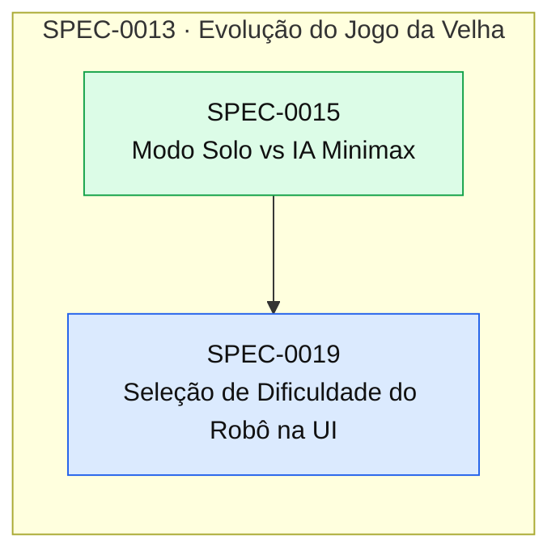

# Índice de Specs

> Gerado por `spec_graph.py index` em 2026-09-29 — não edite manualmente.

## Saúde

- Validação (G0): **77 erro(s), 14 aviso(s)** — rode `spec_graph.py validate`
- Specs: approved 1, implemented 15
- Impedimentos: **0 aberto(s)**, 0 resolvido(s)

## Plano de Execução

**Em andamento:** —  
**Paradas por impedimento:** —  
**Próximo lote:** SPEC-0019

| Onda | Spec | Título | Tier/Tam. | Status | Prontidão | Observação |
|---|---|---|---|---|---|---|
| 1 | SPEC-0019 | Seleção de Dificuldade do Robô na UI | full/S | approved | ✅ pronta |  |

## Épicos

| Épico | Título | Status | Progresso |
|---|---|---|---|
| SPEC-0001 | Fundação do Projeto | implemented | 3/3 implementadas |
| SPEC-0005 | Jogo da Velha | implemented | 3/3 implementadas |
| SPEC-0013 | Evolução do Jogo da Velha | implemented | 5/6 implementadas |

## Grafo de Dependências

Seta contínua: depende da implementação. Seta tracejada: consome contrato.

## Todas as Specs

| ID | Título | Tier | Tipo | Status | Criada | Épico | Depende de | Consome contrato |
|---|---|---|---|---|---|---|---|---|
| [SPEC-0001](SPEC-0001-fundacao-do-projeto.md) | Fundação do Projeto | epic | foundation | implemented | 2026-09-29 | — | — | — |
| [SPEC-0002](SPEC-0002-repositorio-e-ferramental.md) | Repositório e Ferramental | full | foundation | implemented | 2026-09-29 | SPEC-0001 | — | — |
| [SPEC-0003](SPEC-0003-harness-de-testes.md) | Harness de Testes | full | foundation | implemented | 2026-09-29 | SPEC-0001 | SPEC-0002 | — |
| [SPEC-0004](SPEC-0004-walking-skeleton-blazor-aspire-sql.md) | Walking Skeleton (Blazor + Aspire + SQL) | full | foundation | implemented | 2026-09-29 | SPEC-0001 | SPEC-0003 | — |
| [SPEC-0005](SPEC-0005-jogo-da-velha.md) | Jogo da Velha | epic | feature | implemented | 2026-09-29 | — | SPEC-0004 | — |
| [SPEC-0006](SPEC-0006-matchmaking-module.md) | Matchmaking Module | full | feature | implemented | 2026-09-29 | SPEC-0005 | SPEC-0004 | — |
| [SPEC-0007](SPEC-0007-gameplay-module.md) | Gameplay Module | full | feature | implemented | 2026-09-29 | SPEC-0005 | SPEC-0004 | — |
| [SPEC-0008](SPEC-0008-ui-interativa.md) | UI Interativa | full | feature | implemented | 2026-09-29 | SPEC-0005 | SPEC-0006, SPEC-0007 | — |
| [SPEC-0009](SPEC-0009-nomes-de-jogador.md) | Nomes de Jogador | full | feature | implemented | 2026-09-29 | — | SPEC-0008 | — |
| [SPEC-0010](SPEC-0010-historico-de-partidas.md) | Histórico de Partidas | full | feature | implemented | 2026-09-29 | — | SPEC-0009 | — |
| [SPEC-0011](SPEC-0011-navegacao-entre-jogo-e-historico.md) | Navegação entre Jogo e Histórico | lite | feature | implemented | 2026-09-29 | — | SPEC-0010 | — |
| [SPEC-0012](SPEC-0012-jogar-novamente.md) | Jogar Novamente | lite | feature | implemented | 2026-09-29 | — | SPEC-0010, SPEC-0011 | — |
| [SPEC-0013](SPEC-0013-evolucao-do-jogo-da-velha.md) | Evolução do Jogo da Velha | epic | feature | implemented | 2026-09-29 | — | SPEC-0005 | — |
| [SPEC-0014](SPEC-0014-placar-da-sessao-e-efeitos-de-vitoria.md) | Placar da Sessão e Efeitos de Vitória | full | feature | implemented | 2026-09-29 | SPEC-0013 | SPEC-0012 | — |
| [SPEC-0015](SPEC-0015-modo-solo-vs-ia-minimax.md) | Modo Solo vs IA Minimax | full | feature | implemented | 2026-09-29 | SPEC-0013 | SPEC-0014 | — |
| [SPEC-0016](SPEC-0016-salas-privadas-com-codigo.md) | Salas Privadas com Código | full | feature | implemented | 2026-09-29 | SPEC-0013 | SPEC-0014 | — |
| [SPEC-0017](SPEC-0017-leaderboard-e-estatisticas.md) | Leaderboard e Estatísticas | full | feature | implemented | 2026-09-29 | SPEC-0013 | SPEC-0010 | — |
| [SPEC-0018](SPEC-0018-sincronizacao-reativa-por-eventos.md) | Sincronização Reativa por Eventos | full | feature | implemented | 2026-09-29 | SPEC-0013 | SPEC-0016 | — |
| [SPEC-0019](SPEC-0019-selecao-de-dificuldade-do-robo-na-ui.md) | Seleção de Dificuldade do Robô na UI | full | feature | approved | 2026-09-29 | SPEC-0013 | SPEC-0015 | — |

## ADRs

| ID | Título | Status | Garantido por (G3) |
|---|---|---|---|
| [ADR-0001](../adr/ADR-0001-orquestracao-e-desenvolvimento-local.md) | Orquestração e Desenvolvimento Local | accepted | — |
| [ADR-0002](../adr/ADR-0002-frontend-e-ui.md) | Frontend e UI | accepted | — |
| [ADR-0003](../adr/ADR-0003-banco-de-dados.md) | Banco de Dados | accepted | — |
| [ADR-0004](../adr/ADR-0004-arquitetura.md) | Arquitetura | accepted | — |
