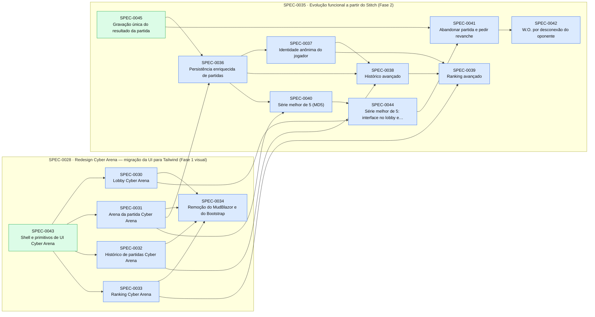

# Índice de Specs

> Gerado por `spec_graph.py index` em 2026-09-29 — não edite manualmente.

## Saúde

- Validação (G0): **0 erro(s), 0 aviso(s)**
- Specs: approved 13, implemented 26
- Impedimentos: **0 aberto(s)**, 0 resolvido(s)

## Plano de Execução

**Em andamento:** —  
**Paradas por impedimento:** —  
**Próximo lote:** SPEC-0030, SPEC-0032, SPEC-0033

| Onda | Spec | Título | Tier/Tam. | Status | Prontidão | Observação |
|---|---|---|---|---|---|---|
| 1 | SPEC-0030 | Lobby Cyber Arena | full/M | approved | ✅ pronta |  |
| 1 | SPEC-0032 | Histórico de partidas Cyber Arena | full/S | approved | ✅ pronta |  |
| 1 | SPEC-0033 | Ranking Cyber Arena | full/S | approved | ✅ pronta |  |
| 2 | SPEC-0031 | Arena da partida Cyber Arena | full/M | approved | ✅ pronta | saiu da onda 1: arquivos em comum com SPEC-0030 |
| 3 | SPEC-0034 | Remoção do MudBlazor e do Bootstrap | full/M | approved | ⛔ aguarda implementação de SPEC-0030; aguarda implementação de SPEC-0031; aguarda implementação de SPEC-0032; aguarda implementação de SPEC-0033 |  |
| 3 | SPEC-0036 | Persistência enriquecida de partidas | full/M | approved | ⛔ aguarda implementação de SPEC-0031 |  |
| 4 | SPEC-0037 | Identidade anônima do jogador | full/M | approved | ⛔ aguarda implementação de SPEC-0036 |  |
| 5 | SPEC-0038 | Histórico avançado | full/M | approved | ⛔ aguarda implementação de SPEC-0032; aguarda implementação de SPEC-0036; aguarda implementação de SPEC-0037 |  |
| 6 | SPEC-0039 | Ranking avançado | full/M | approved | ⛔ aguarda implementação de SPEC-0033; aguarda implementação de SPEC-0037; aguarda implementação de SPEC-0038 |  |
| 7 | SPEC-0040 | Série melhor de 5 (MD5) | full/M | approved | ⛔ aguarda implementação de SPEC-0031; aguarda implementação de SPEC-0036 | saiu da onda 4: arquivos em comum com SPEC-0037; saiu da onda 5: arquivos em comum com SPEC-0038; saiu da onda 6: arquivos em comum com SPEC-0039 |
| 8 | SPEC-0044 | Série melhor de 5: interface no lobby e na arena | full/M | approved | ⛔ aguarda implementação de SPEC-0030; aguarda implementação de SPEC-0040 |  |
| 9 | SPEC-0041 | Abandonar partida e pedir revanche | full/M | approved | ⛔ aguarda implementação de SPEC-0044 |  |
| 10 | SPEC-0042 | W.O. por desconexão do oponente | full/M | approved | ⛔ aguarda implementação de SPEC-0041 |  |

## Épicos

| Épico | Título | Status | Progresso |
|---|---|---|---|
| SPEC-0001 | Fundação do Projeto | implemented | 3/3 implementadas |
| SPEC-0005 | Jogo da Velha | implemented | 3/3 implementadas |
| SPEC-0013 | Evolução do Jogo da Velha | implemented | 6/6 implementadas |
| SPEC-0021 | Engenharia de Qualidade e Refatoração Arquitetural | implemented | 4/4 implementadas |
| SPEC-0028 | Redesign Cyber Arena — migração da UI para Tailwind (Fase 1 visual) | approved | 2/7 implementadas |
| SPEC-0035 | Evolução funcional a partir do Stitch (Fase 2) | approved | 1/9 implementadas |

## Grafo de Dependências

Seta contínua: depende da implementação. Seta tracejada: consome contrato.

## Todas as Specs

| ID | Título | Tier | Tipo | Status | Criada | Épico | Depende de | Consome contrato |
|---|---|---|---|---|---|---|---|---|
| [SPEC-0001](SPEC-0001-fundacao-do-projeto.md) | Fundação do Projeto | epic | foundation | implemented | 2026-09-29 | — | — | — |
| [SPEC-0002](SPEC-0002-repositorio-e-ferramental.md) | Repositório e Ferramental | full | foundation | implemented | 2026-09-29 | SPEC-0001 | — | — |
| [SPEC-0003](SPEC-0003-harness-de-testes.md) | Harness de Testes | full | foundation | implemented | 2026-09-29 | SPEC-0001 | SPEC-0002 | — |
| [SPEC-0004](SPEC-0004-walking-skeleton-blazor-aspire-sql.md) | Walking Skeleton (Blazor + Aspire + SQL) | full | foundation | implemented | 2026-09-29 | SPEC-0001 | SPEC-0003 | — |
| [SPEC-0005](SPEC-0005-jogo-da-velha.md) | Jogo da Velha | epic | feature | implemented | 2026-09-29 | — | SPEC-0004 | — |
| [SPEC-0006](SPEC-0006-matchmaking-module.md) | Matchmaking Module | full | feature | implemented | 2026-09-29 | SPEC-0005 | SPEC-0004 | — |
| [SPEC-0007](SPEC-0007-gameplay-module.md) | Gameplay Module | full | feature | implemented | 2026-09-29 | SPEC-0005 | SPEC-0004 | — |
| [SPEC-0008](SPEC-0008-ui-interativa.md) | UI Interativa | full | feature | implemented | 2026-09-29 | SPEC-0005 | SPEC-0006, SPEC-0007 | — |
| [SPEC-0009](SPEC-0009-nomes-de-jogador.md) | Nomes de Jogador | full | feature | implemented | 2026-09-29 | — | SPEC-0008 | — |
| [SPEC-0010](SPEC-0010-historico-de-partidas.md) | Histórico de Partidas | full | feature | implemented | 2026-09-29 | — | SPEC-0009 | — |
| [SPEC-0011](SPEC-0011-navegacao-entre-jogo-e-historico.md) | Navegação entre Jogo e Histórico | lite | feature | implemented | 2026-09-29 | — | SPEC-0010 | — |
| [SPEC-0012](SPEC-0012-jogar-novamente.md) | Jogar Novamente | lite | feature | implemented | 2026-09-29 | — | SPEC-0010, SPEC-0011 | — |
| [SPEC-0013](SPEC-0013-evolucao-do-jogo-da-velha.md) | Evolução do Jogo da Velha | epic | feature | implemented | 2026-09-29 | — | SPEC-0005 | — |
| [SPEC-0014](SPEC-0014-placar-da-sessao-e-efeitos-de-vitoria.md) | Placar da Sessão e Efeitos de Vitória | full | feature | implemented | 2026-09-29 | SPEC-0013 | SPEC-0012 | — |
| [SPEC-0015](SPEC-0015-modo-solo-vs-ia-minimax.md) | Modo Solo vs IA Minimax | full | feature | implemented | 2026-09-29 | SPEC-0013 | SPEC-0014 | — |
| [SPEC-0016](SPEC-0016-salas-privadas-com-codigo.md) | Salas Privadas com Código | full | feature | implemented | 2026-09-29 | SPEC-0013 | SPEC-0014 | — |
| [SPEC-0017](SPEC-0017-leaderboard-e-estatisticas.md) | Leaderboard e Estatísticas | full | feature | implemented | 2026-09-29 | SPEC-0013 | SPEC-0010 | — |
| [SPEC-0018](SPEC-0018-sincronizacao-reativa-por-eventos.md) | Sincronização Reativa por Eventos | full | feature | implemented | 2026-09-29 | SPEC-0013 | SPEC-0016 | — |
| [SPEC-0019](SPEC-0019-selecao-de-dificuldade-do-robo-na-ui.md) | Seleção de Dificuldade do Robô na UI | full | feature | implemented | 2026-09-29 | SPEC-0013 | SPEC-0015 | — |
| [SPEC-0020](SPEC-0020-correcao-de-inversao-de-nomes-em-salas-privadas-e-partidas.md) | Correção de Inversão de Nomes em Salas Privadas e Partidas | lite | fix | implemented | 2026-09-29 | — | — | — |
| [SPEC-0021](SPEC-0021-engenharia-de-qualidade-e-refatoracao-arquitetural.md) | Engenharia de Qualidade e Refatoração Arquitetural | epic | feature | implemented | 2026-09-29 | — | — | — |
| [SPEC-0022](SPEC-0022-padronizacao-de-codigo-com-editorconfig-e-directory-build-pr.md) | Padronização de Código com EditorConfig e Directory.Build.props | full | foundation | implemented | 2026-09-29 | SPEC-0021 | — | — |
| [SPEC-0023](SPEC-0023-infraestrutura-de-cobertura-de-codigo-e-testes-com-bunit.md) | Infraestrutura de Cobertura de Código e Testes com bUnit | full | foundation | implemented | 2026-09-29 | SPEC-0021 | SPEC-0022 | — |
| [SPEC-0024](SPEC-0024-decomposicao-do-componente-home-e-isolamento-de-css.md) | Decomposição do Componente Home e Isolamento de CSS | full | refactor | implemented | 2026-09-29 | SPEC-0021 | SPEC-0023 | — |
| [SPEC-0025](SPEC-0025-eventos-em-tempo-real-sem-polling-e-ef-core-migrations.md) | Eventos em Tempo Real sem Polling e EF Core Migrations | full | refactor | implemented | 2026-09-29 | SPEC-0021 | SPEC-0024 | — |
| [SPEC-0026](SPEC-0026-redesign-de-ui-e-tema-escuro-com-mudblazor.md) | Redesign de UI e Tema Escuro Imersivo com MudBlazor | full | migration | implemented | 2026-09-29 | — | — | — |
| [SPEC-0027](SPEC-0027-timer-de-turno-e-timeout-por-w-o.md) | Timer de turno e timeout por W.O. | full | feature | implemented | 2026-09-29 | — | — | — |
| [SPEC-0028](SPEC-0028-redesign-cyber-arena-migracao-da-ui-para-tailwind-fase-1-vis.md) | Redesign Cyber Arena — migração da UI para Tailwind (Fase 1 visual) | epic | migration | approved | 2026-09-29 | — | — | — |
| [SPEC-0029](SPEC-0029-pipeline-tailwind-tokens-e-fontes-cyber-arena.md) | Pipeline Tailwind, tokens e fontes Cyber Arena | full | migration | implemented | 2026-09-29 | SPEC-0028 | — | — |
| [SPEC-0030](SPEC-0030-lobby-cyber-arena.md) | Lobby Cyber Arena | full | feature | approved | 2026-09-29 | SPEC-0028 | SPEC-0043 | — |
| [SPEC-0031](SPEC-0031-arena-da-partida-cyber-arena.md) | Arena da partida Cyber Arena | full | feature | approved | 2026-09-29 | SPEC-0028 | SPEC-0043 | — |
| [SPEC-0032](SPEC-0032-historico-de-partidas-cyber-arena.md) | Histórico de partidas Cyber Arena | full | feature | approved | 2026-09-29 | SPEC-0028 | SPEC-0043 | — |
| [SPEC-0033](SPEC-0033-ranking-cyber-arena.md) | Ranking Cyber Arena | full | feature | approved | 2026-09-29 | SPEC-0028 | SPEC-0043 | — |
| [SPEC-0034](SPEC-0034-remocao-do-mudblazor-e-do-bootstrap.md) | Remoção do MudBlazor e do Bootstrap | full | migration | approved | 2026-09-29 | SPEC-0028 | SPEC-0030, SPEC-0031, SPEC-0032, SPEC-0033 | — |
| [SPEC-0035](SPEC-0035-evolucao-funcional-a-partir-do-stitch-fase-2.md) | Evolução funcional a partir do Stitch (Fase 2) | epic | feature | approved | 2026-09-29 | — | — | — |
| [SPEC-0036](SPEC-0036-persistencia-enriquecida-de-partidas.md) | Persistência enriquecida de partidas | full | feature | approved | 2026-09-29 | SPEC-0035 | SPEC-0031, SPEC-0045 | — |
| [SPEC-0037](SPEC-0037-identidade-anonima-do-jogador.md) | Identidade anônima do jogador | full | feature | approved | 2026-09-29 | SPEC-0035 | SPEC-0036 | — |
| [SPEC-0038](SPEC-0038-historico-avancado.md) | Histórico avançado | full | feature | approved | 2026-09-29 | SPEC-0035 | SPEC-0032, SPEC-0036, SPEC-0037 | — |
| [SPEC-0039](SPEC-0039-ranking-avancado.md) | Ranking avançado | full | feature | approved | 2026-09-29 | SPEC-0035 | SPEC-0033, SPEC-0037, SPEC-0038 | — |
| [SPEC-0040](SPEC-0040-serie-melhor-de-5-md5.md) | Série melhor de 5 (MD5) | full | feature | approved | 2026-09-29 | SPEC-0035 | SPEC-0031, SPEC-0036 | — |
| [SPEC-0041](SPEC-0041-abandonar-partida-e-pedir-revanche.md) | Abandonar partida e pedir revanche | full | feature | approved | 2026-09-29 | SPEC-0035 | SPEC-0044, SPEC-0045 | — |
| [SPEC-0042](SPEC-0042-w-o-por-desconexao-do-oponente.md) | W.O. por desconexão do oponente | full | feature | approved | 2026-09-29 | SPEC-0035 | SPEC-0041 | — |
| [SPEC-0043](SPEC-0043-shell-e-primitivos-de-ui-cyber-arena.md) | Shell e primitivos de UI Cyber Arena | full | feature | implemented | 2026-09-29 | SPEC-0028 | SPEC-0029 | — |
| [SPEC-0044](SPEC-0044-serie-melhor-de-5-interface-no-lobby-e-na-arena.md) | Série melhor de 5: interface no lobby e na arena | full | feature | approved | 2026-09-29 | SPEC-0035 | SPEC-0030, SPEC-0040 | — |
| [SPEC-0045](SPEC-0045-gravacao-unica-do-resultado-da-partida.md) | Gravação única do resultado da partida | full | fix | implemented | 2026-09-29 | SPEC-0035 | — | — |

## ADRs

| ID | Título | Status | Garantido por (G3) |
|---|---|---|---|
| [ADR-0001](../adr/ADR-0001-orquestracao-e-desenvolvimento-local.md) | Orquestração e Desenvolvimento Local | accepted | N/A — histórico |
| [ADR-0002](../adr/ADR-0002-frontend-e-ui.md) | Frontend e UI | accepted | N/A — histórico |
| [ADR-0003](../adr/ADR-0003-banco-de-dados.md) | Banco de Dados | accepted | N/A — histórico |
| [ADR-0004](../adr/ADR-0004-arquitetura.md) | Arquitetura | accepted | N/A — histórico |
| [ADR-0005](../adr/ADR-0005-padronizacao-de-analise-estatica-e-compilacao-estrita.md) | Padronização de Análise Estática e Compilação Estrita | accepted | Directory.Build.props e dotnet format |
| [ADR-0006](../adr/ADR-0006-componentizacao-blazor-css-isolation-e-testes-com-bunit.md) | Componentização Blazor, CSS Isolation e Testes com bUnit | accepted | Testes de componentes bUnit |
| [ADR-0007](../adr/ADR-0007-adocao-do-mudblazor-como-design-system-e-componentes.md) | Adoção do MudBlazor como Design System e Componentes | accepted | tests/TicTacToe.Tests/MudBlazorIntegrationTests.cs |
| [ADR-0008](../adr/ADR-0008-tailwind-css-standalone-como-camada-de-estilo-e-design-syste.md) | Tailwind CSS standalone como camada de estilo e design system próprio | accepted | tests/TicTacToe.Tests/TailwindDesignSystemTests.cs |
| [ADR-0009](../adr/ADR-0009-identidade-anonima-persistente-do-jogador.md) | Identidade anônima persistente do jogador | accepted | tests/TicTacToe.Tests/PlayerIdentityTests.cs |
